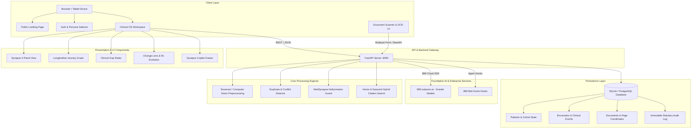

# Architecture

## System Architecture

MedSynapse AI is designed as a resilient, decoupled web application featuring a fast asynchronous backend API, modern interactive frontend, multimodal OCR ingestion pipeline, and an enterprise foundation model inference layer powered by IBM watsonx.ai.



## System Components

| Component | Technology Stack | Core Responsibility |
|---|---|---|
| **Frontend UI** | React 18, Vite 5, TypeScript, Tailwind CSS | High-performance clinical command center, interactive SVG journey graph, AIC-inspired design system, adaptive Light/Dark mode, bedside ward round view. |
| **Backend API** | Python 3.11+, FastAPI, Pydantic v2 | High-concurrency REST API, schema validation, patient CRUD, document ingestion orchestration, session management, and audit logging. |
| **AI Reasoning & Extraction** | IBM watsonx.ai (`ibm/granite-13b-chat-v2`), IBM Bob | Medical entity extraction, structured JSON normalization, clinical summary synthesis, and deterministic evidence linking. |
| **OCR & Preprocessing** | Tesseract OCR, Pillow, Computer Vision | Document deskewing, binarization, optical character recognition, and confidence scoring. |
| **Data Persistence** | SQLAlchemy ORM, SQLite (PostgreSQL & pgvector ready) | Relational persistence of patient profiles, clinical events, medications, lab investigations, evidence coordinates, and audit entries. |
| **Interoperability Layer** | ABDM M1-M3 Connectors, HL7 FHIR R4 Sandbox | FHIR bundle translation, ABHA patient ID mapping, and consent-based health data exchange. |

## Data Flow Pipeline

```text
[1. Ingestion]           Doctor uploads PDF / captures image via device camera
      │
[2. Preprocessing]       Resolution normalization, contrast adjustment, and noise filtering
      │
[3. OCR Extraction]      Per-page text extraction with per-character bounding and confidence score
      │
[4. AI Structuring]      IBM watsonx.ai Granite extracts diagnoses, medications, labs, and dates
      │
[5. Evidence Linking]    Exact document, page, and snippet offsets linked to every extracted fact
      │
[6. Graph Build]         Temporal ordering and dependency graph generated across all historical encounters
      │
[7. Gap & Conflict]      Automated detection of missing investigation reports and conflicting dosages
      │
[8. Clinician Verify]    Doctor reviews findings in Synapse View, approves or edits in Review Queue
      │
[9. Export / Handoff]    Evidence-grounded referral letter or discharge summary generated with Second Look audit
```

## Security & Compliance Architecture

- **Role-Based Access Control (RBAC)**: Distinct permissions for `Doctor`, `Senior Doctor / Reviewer`, `Department Admin`, and `Records Manager`.
- **Zero Hallucination Guard**: Claims lacking direct textual support in uploaded documents are strictly categorized as *"Inferred — Review Required"* or *"Not Found in Records"*.
- **Immutable Statutory Audit Trail**: Every access event, document upload, verification, record edit, and PDF export is permanently recorded with timestamps, user ID, role, and client IP.
- **Credential Isolation**: All IBM Cloud API keys, project IDs, and database secrets are isolated in environment variables (`.env`) and never exposed to client-side bundles.

## Scalability & Production Readiness

- **Stateless Backend**: The FastAPI backend is completely stateless, supporting horizontal replication across Kubernetes clusters behind an NGINX or Envoy load balancer.
- **Asynchronous Document Pipelines**: Document OCR and multimodal extraction utilize asynchronous task processing to ensure instantaneous UI responsiveness.
- **Database Scalability**: Designed with SQLAlchemy ORM abstraction, allowing zero-friction migration from SQLite to AWS RDS / IBM Cloud PostgreSQL with `pgvector` for enterprise multi-tenant deployments.
