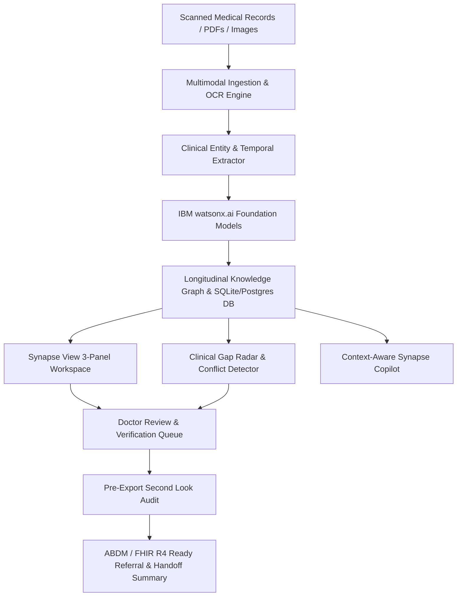

# Solution Overview

## What We Built

**MedSynapse AI** is an advanced clinical journey reconstruction and evidence intelligence platform engineered for modern healthcare providers. Rather than merely summarizing medical files or answering freeform questions, MedSynapse transforms fragmented multi-page documents (discharge summaries, outpatient prescriptions, laboratory panels, imaging reports) into an understandable, chronological, and verifiable longitudinal patient journey.

Every AI-extracted finding is anchored directly to source documents with page and bounding coordinates, ensuring **zero hallucinations** and providing clinicians with a dependable, audit-ready clinical operating system.

## How It Works

The core product loop operates through a disciplined 7-stage pipeline:

```text
DOCUMENT → UNDERSTAND → RECONSTRUCT → COMPARE → DETECT → VERIFY → ASSIST
```

1. **Document Ingestion & Multimodal OCR**: Scanned PDFs and mobile camera captures are processed through computer-vision preprocessing, de-skewing, and OCR extraction with per-token confidence metrics.
2. **Clinical Entity & Temporal Extraction**: Biomedical entities (diagnoses, ICD-10 classifications, RxNorm medications, lab observations) are extracted and ordered chronologically.
3. **Longitudinal Journey Reconstruction**: Disparate admissions and encounters are linked into an interactive timeline and multi-relational knowledge graph (*HAD_ADMISSION*, *RESULTED_IN*, *CHANGED_TO*, *SUPPORTED_BY*).
4. **Change Lens & Medication Evolution**: Chronological tracking of pharmacotherapy shifts (*Started*, *Dose Escalated*, *Continued*, *Discontinued*) with documented indications.
5. **Gap Surveillance & Conflict Detection**: The Gap Radar flags referenced investigations lacking formal reports, while the Conflict Detector identifies dosage discrepancies and contradictory allergy notes.
6. **Doctor Verification & Audit**: Clinicians review, flag, or approve findings in a dedicated Review Queue before handoff or referral export.
7. **Context-Aware Synapse Copilot**: A patient-aware clinical AI assistant answers complex temporal queries backed by clickable evidence chips and citations.

## High-Level Architecture Flow



## Key Design Decisions

| Decision | Rationale |
|---|---|
| **Evidence-First Grounding (Zero Hallucination Guard)** | Clinical trust requires explainability. Every single AI claim links to Document ID, Page Number, and Section Text. Unsupported speculation is strictly suppressed. |
| **Longitudinal Graph over Flat Summaries** | Patient health is inherently relational and temporal. Knowledge graphs enable cross-encounter change detection and dependency tracing that text summaries lose. |
| **Granular Clinical RBAC & Privacy Scoping** | Strict role separation (Doctor, Reviewer, Admin, Records Manager) prevents unauthorized exposure and guarantees medical legal accountability. |
| **Interactive 3-Panel Synchronized Synapse View** | Clicking any event on the Timeline simultaneously illuminates the Clinical Intelligence card and scrolls the Evidence Rail to the exact page excerpt. |
| **ABDM Milestone 1–3 & FHIR R4 Architecture** | Future-proofs hospital deployment by aligning with national digital health standards and standard HL7 FHIR resource bundles. |

## IBM Technologies Used

MedSynapse AI leverages enterprise IBM cloud and AI infrastructure to ensure rigorous clinical governance, low latency, and zero data leakage:

- **IBM watsonx.ai (`ibm/granite-13b-chat-v2` & `ibm/granite-3.0-8b-instruct`)**:
  - Powers biomedical entity normalization, structured JSON extraction from noisy clinical OCR, and clinical summary generation with strict JSON schema guardrails.
  - Temperature set to `0.1` with `top_p=0.95` to enforce deterministic, strictly grounded clinical extraction without creative drift.

- **IBM watsonx Discovery / Hybrid Retrieval**:
  - Implements character-offset and coordinate-level citation retrieval against hospital document corpora, delivering sub-second evidence lookups.

- **IBM Bob (Agentic Clinical Framework)**:
  - Orchestrates asynchronous background events: triggers automatic review queue items when documentation conflicts are detected, and coordinates the pre-export Second Look audit before clinical referral generation.
